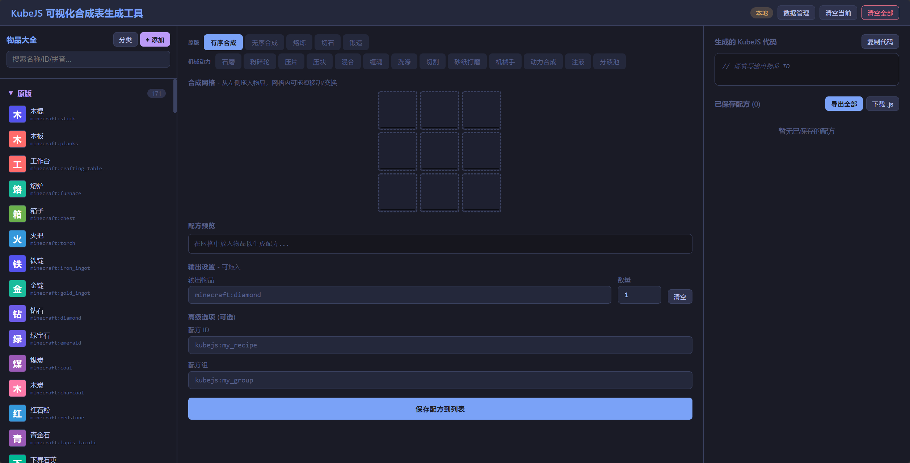
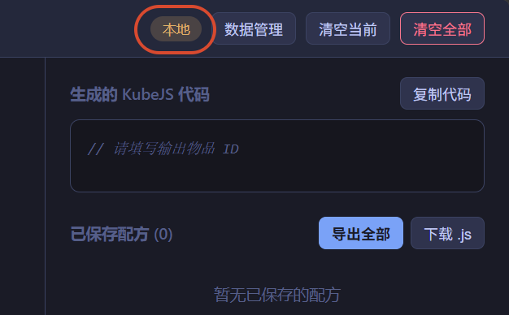
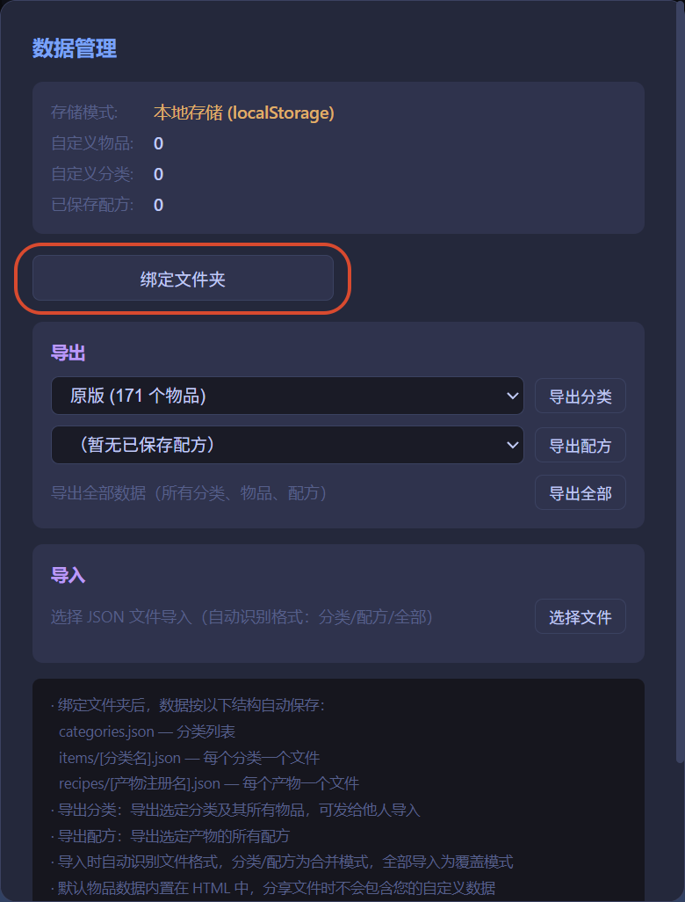
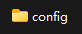
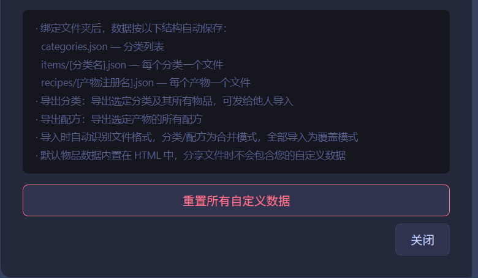

# KubeJS可视化配方编辑器

闲着无聊拿WorkBuddy摸的一个小工具，我自己也还没用，不知道bug多不多

## 开始前的配置
- 打开后，界面应该长这个样子：  

- 因为html无法在不经过同意的情况下修改文件，所以需要手动配置一下数据存放路径
- 这一步不配置也能用，但是建议还是配置一下，能够更方便的管理自己的物品库和配方，也能轻松导入别人做好的物品库
- 先点击本地   

- 选择绑定文件夹  

- 找到路径后，这里已经准备好了一个名叫 'config' 的空文件夹，只要绑定他就可以
- 当然，如果你有其他想要绑定的文件夹也可以，只不过最好是空文件夹  

- 设置完后，右下角会弹出绿色的绑定成功提示
- 之后滑倒最下面，点击关闭就好了

## 使用方法

说实话，这个界面我认为一目了然，基础用法大家到处点点就会了

先简单说下分类，点击左上角**物品大全**旁边的**分类**可以新建分类

右键新建的分类，可以向里面添加物品，重命名分类，删除分类

主要是**数据管理**里的**导出**和**导入**

>导出

你可以选择一个你创建并制作的分类，并把它导出为一个.json文件

>导入

你可以选择一个符合格式要求的json文件，并把它导入进工具，直接在左侧创建包含对应物品的分类